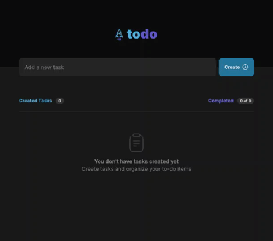

<h3 align="center">
  Challenge: ToDo List
</h3>

  
  
  
  

  <a href="#rocket-about-the-challenge">About the Challenge</a>&nbsp;&nbsp;&nbsp;|&nbsp;&nbsp;&nbsp;
  <a href="#technologies">Technologies</a>&nbsp;&nbsp;&nbsp;|&nbsp;&nbsp;&nbsp;
  <a href="#installation">Installation</a>&nbsp;&nbsp;&nbsp;|&nbsp;&nbsp;&nbsp;
  <a href="#memo-license">License</a>

 

---

## :rocket: About the Challenge

The main objective of the challenge is to create a **to-do list** with the following features:
- Add a new task
- Check and uncheck a task as complete
- Remove a task from the list
- Show task completion progress

## Technologies

- [ReactJS](https://reactjs.org/)
- [Typescript](https://www.typescriptlang.org/)
- [Vite](https://vitejs.dev/)
- [Styled Components](https://styled-components.com/)

## Installation

1. Clone the repository: `git@github.com:matheus-neves/ignite-todo-challenge.git`
2. Access the directory: `cd ignite-todo-challenge`
3. Install the dependencies: `yarn`
4. Run the app: `yarn dev`

## :memo: License

This challenge is under license from MIT. See the archive [LICENSE](https://github.com/matheus-neves/ignite-todo-challenge/blob/main/LICENSE.md) for more details.

---

Challenge completed :heavy_check_mark:

Made with 💜 by Matheus Neves [See my linkedin!](https://www.linkedin.com/in/matheus-neves-front-end/) :wave:

